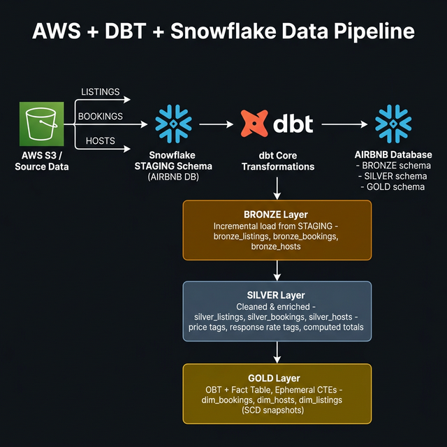
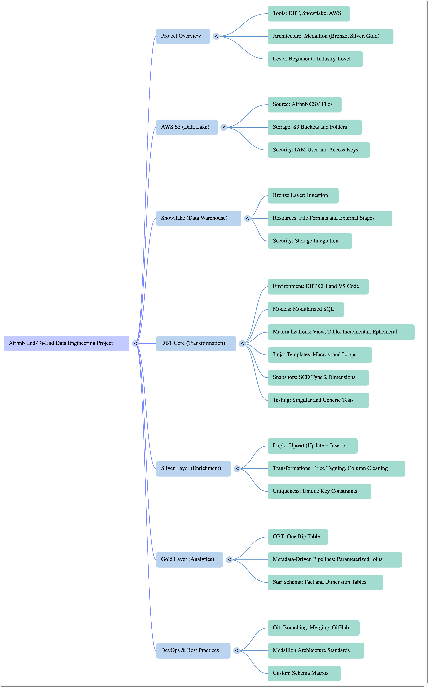
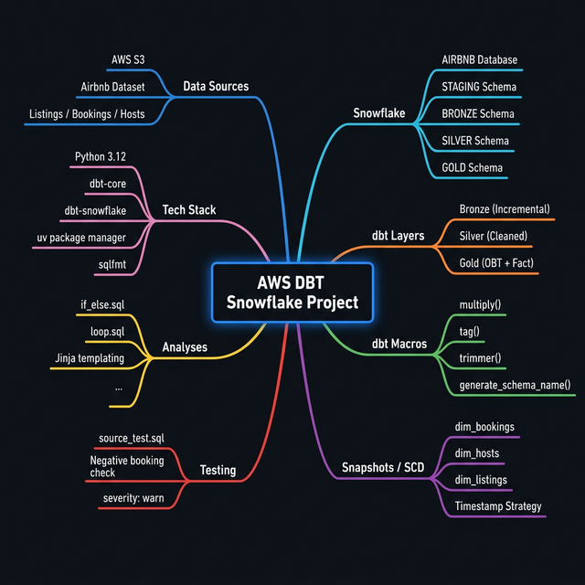

# 🏔️ AWS + DBT + Snowflake Data Pipeline

> **A production-grade, end-to-end data engineering pipeline** built on the Medallion Architecture (Bronze → Silver → Gold) using AWS S3 as the data source, Snowflake as the cloud data warehouse, and dbt Core as the transformation engine — all packaged with Python `uv` dependency management.

---

## 📋 Table of Contents

- [Project Overview](#-project-overview)
- [Architecture & Pipeline](#-architecture--pipeline)
- [Mind Map](#-mind-map)
- [Tech Stack](#-tech-stack)
- [Project Structure](#-project-structure)
- [Data Sources](#-data-sources)
- [Medallion Architecture Layers](#-medallion-architecture-layers)
  - [🟤 Bronze Layer](#-bronze-layer)
  - [⬜ Silver Layer](#-silver-layer)
  - [🟡 Gold Layer](#-gold-layer)
- [dbt Macros](#-dbt-macros)
- [Snapshots (SCD Type 2)](#-snapshots-scd-type-2)
- [Tests](#-tests)
- [Analyses](#-analyses)
- [Snowflake Configuration](#-snowflake-configuration)
- [Getting Started](#-getting-started)
- [dbt Commands Reference](#-dbt-commands-reference)

---

## 🌐 Project Overview

This project implements a **full data engineering pipeline** for an Airbnb-like platform dataset. Raw data originating from **AWS S3** is loaded into a **Snowflake** staging schema, then transformed through three progressive quality layers using **dbt Core**:

| Layer  | Schema   | Purpose                              | Materialization |
|--------|----------|--------------------------------------|-----------------|
| Bronze | `BRONZE` | Raw ingestion from STAGING           | Incremental     |
| Silver | `SILVER` | Cleaned, enriched, business-ready    | Incremental     |
| Gold   | `GOLD`   | Aggregated OBT, Fact table, SCD dims | Table + Ephemeral |

The pipeline processes **three core entities**: `LISTINGS`, `BOOKINGS`, and `HOSTS`.

---

## 🏗️ Architecture & Pipeline

The diagram below illustrates the complete data flow — from raw AWS S3 source files, through the Snowflake staging area, and across all three dbt transformation layers into the final analytical Gold layer.



> **Data Flow:**  
> `AWS S3` → `Snowflake STAGING` → `dbt Bronze` → `dbt Silver` → `dbt Gold` → `Snowflake AIRBNB DB`

The pipeline leverages:
- **Incremental loading** at Bronze and Silver to process only new records (using `CREATED_AT` watermarking)
- **Jinja-powered macros** for reusable SQL transformation logic
- **Ephemeral CTEs** in Gold for lightweight, in-query sub-models that don't materialize as physical tables
- **SCD Type 2 snapshots** to track historical changes in dimension tables

---

## 🧠 Mind Map

The mind map below visualizes the full scope of the project — all components, layers, tools, and interconnections at a glance.





---

## 🛠️ Tech Stack

| Tool / Technology     | Version      | Role                                      |
|-----------------------|--------------|-------------------------------------------|
| **Python**            | ≥ 3.12       | Runtime environment                       |
| **uv**                | latest       | Fast Python package & dependency manager  |
| **dbt-core**          | ≥ 1.11.7     | Data transformation engine                |
| **dbt-snowflake**     | ≥ 1.11.3     | Snowflake adapter for dbt                 |
| **Snowflake**         | Cloud        | Cloud data warehouse                      |
| **AWS S3**            | Cloud        | Source data lake / raw file storage       |
| **sqlfmt**            | ≥ 0.0.3      | SQL formatter for dbt models              |
| **Jinja2**            | (via dbt)    | Templating engine for dynamic SQL         |

---

## 📁 Project Structure

```
AWS_DBT_Snowflake/
│
├── aws_dbt_snowflake_project/       # dbt project root
│   ├── dbt_project.yml              # Project configuration & materializations
│   ├── profiles.yml                 # Snowflake connection profiles
│   │
│   ├── models/                      # dbt transformation models
│   │   ├── sources/
│   │   │   └── sources.yaml         # Source table declarations (AIRBNB.STAGING)
│   │   ├── bronze/                  # Raw ingestion layer
│   │   │   ├── bronze_bookings.sql
│   │   │   ├── bronze_hosts.sql
│   │   │   └── bronze_listings.sql
│   │   ├── silver/                  # Cleaned & enriched layer
│   │   │   ├── silver_bookings.sql
│   │   │   ├── silver_hosts.sql
│   │   │   └── silver_listings.sql
│   │   └── gold/                    # Analytical & dimensional layer
│   │       ├── obt.sql              # One Big Table (all entities joined)
│   │       ├── fact.sql             # Fact table with dimension joins
│   │       └── ephemeral/           # In-query ephemeral CTEs
│   │           ├── bookings.sql
│   │           ├── hosts.sql
│   │           └── listings.sql
│   │
│   ├── macros/                      # Reusable Jinja SQL macros
│   │   ├── generate_schema_name.sql # Custom schema name override
│   │   ├── multiply.sql             # Precision multiplication macro
│   │   ├── tag.sql                  # Price range tagger macro
│   │   └── trimmer.sql              # String trimmer/uppercaser macro
│   │
│   ├── snapshots/                   # SCD Type 2 snapshot configs
│   │   ├── dim_bookings.yml
│   │   ├── dim_hosts.yml
│   │   └── dim_listings.yml
│   │
│   ├── tests/                       # Custom data quality tests
│   │   └── source_test.sql          # Validates no negative booking amounts
│   │
│   ├── analyses/                    # Ad-hoc Jinja analysis scripts
│   │   ├── if_else.sql              # Conditional Jinja logic demo
│   │   ├── loop.sql                 # Loop-based Jinja demo
│   │   └── test.sql                 # Basic analysis test
│   │
│   └── seeds/                       # (Reserved for seed CSV data)
│
├── images/                          # Architecture diagrams & visuals
│   ├── pipeline_overview.png        # Full pipeline architecture
│   ├── Project_Mind_Map.png         # Original project mind map
│   ├── pipeline_diagram.png         # Generated pipeline diagram
│   └── mindmap_diagram.png          # Generated mind map
│
├── main.py                          # Python entry point
├── pyproject.toml                   # Python project & dependency config
├── uv.lock                          # Locked dependency tree
└── .python-version                  # Python version pin
```

---

## 📦 Data Sources

All source data is declared in `models/sources/sources.yaml` and points to the `AIRBNB` database, `STAGING` schema in Snowflake:

```yaml
sources:
  - name: STAGING
    database: AIRBNB
    schema: STAGING
    tables:
      - name: LISTINGS    # Property listing details
      - name: BOOKINGS    # Customer booking transactions
      - name: HOSTS       # Host profile information
```

These three raw tables are the **single source of truth** that feeds the entire pipeline.

---

## 🥇 Medallion Architecture Layers

### 🟤 Bronze Layer

**Location:** `models/bronze/` | **Schema:** `AIRBNB.BRONZE` | **Materialization:** `Incremental`

The Bronze layer performs a **direct, efficient ingestion** from the STAGING area. All three models use incremental loading with watermark filtering on `CREATED_AT` to process only new records on each run.

| Model               | Source Table         | Incremental Key |
|---------------------|----------------------|-----------------|
| `bronze_bookings`   | `STAGING.BOOKINGS`   | `CREATED_AT`    |
| `bronze_hosts`      | `STAGING.HOSTS`      | `CREATED_AT`    |
| `bronze_listings`   | `STAGING.LISTINGS`   | `CREATED_AT`    |

**Incremental pattern used:**
```sql

where CREATED_AT > (select coalesce(max(CREATED_AT), '1900-01-01') from {{ this }})

```

> This watermark strategy ensures **idempotent, efficient refreshes** — only new records since the last successful run are loaded.

---

### ⬜ Silver Layer

**Location:** `models/silver/` | **Schema:** `AIRBNB.SILVER` | **Materialization:** `Incremental`

The Silver layer applies **business logic, enrichments, and data cleansing**. Each model references its corresponding Bronze model using `{{ ref() }}`.

#### `silver_bookings`
- Selects core booking fields
- Computes **`TOTAL_BOOKING_AMOUNT`** using the `multiply()` macro: `NIGHTS_BOOKED × BOOKING_AMOUNT`
- Unique key: `BOOKING_ID`

#### `silver_hosts`
- Normalizes `HOST_NAME` by replacing spaces with underscores
- Adds `RESPONSE_RATE_TAG` using a CASE expression:

  | Response Rate | Tag         |
  |---------------|-------------|
  | < 95%         | `VERY GOOD` |
  | < 80%         | `GOOD`      |
  | ≥ 80%         | `POOR`      |

- Unique key: `HOST_ID`

#### `silver_listings`
- Carries all listing attributes: `PROPERTY_TYPE`, `ROOM_TYPE`, `BEDROOMS`, `BATHROOMS`, `ACCOMMODATES`, `CITY`, `COUNTRY`
- Adds **`PRICE_PER_NIGHT_TAG`** via the `tag()` macro:

  | Price Per Night | Tag      |
  |-----------------|----------|
  | < $100          | `low`    |
  | $100 – $199     | `medium` |
  | ≥ $200          | `high`   |

- Unique key: `LISTING_ID`

---

### 🟡 Gold Layer

**Location:** `models/gold/` | **Schema:** `AIRBNB.GOLD` | **Materialization:** `Table` + `Ephemeral`

The Gold layer is the **analytical output** — optimised for BI tools, dashboards, and reporting queries.

#### `obt.sql` — One Big Table

A **Jinja-loop-driven** dynamically generated SQL model that joins all three Silver tables into a single wide table:

```
SILVER_BOOKINGS
  ↳ LEFT JOIN SILVER_LISTINGS  (on listing_id)
      ↳ LEFT JOIN SILVER_HOSTS (on host_id)
```

The table config is driven by a Jinja list of dicts (`congigs`), making it easy to extend with new joins without rewriting the SQL template.

#### `fact.sql` — Fact Table

Further refines the OBT by joining with **Gold dimension tables** (`DIM_LISTINGS`, `DIM_HOSTS`) to produce a clean analytical fact table with only the key metrics needed for reporting.

#### Ephemeral Models (`ephemeral/`)

Three **ephemeral CTE** models are defined that project focused subsets of the OBT. These are not persisted as tables — they are inlined into the query at runtime:

| Model              | Fields Projected                                           |
|--------------------|-----------------------------------------------------------|
| `bookings.sql`     | `BOOKING_ID`, `BOOKING_STATUS`, `CREATED_AT`              |
| `hosts.sql`        | `HOST_ID`, `HOST_NAME`, `IS_SUPERHOST`, `RESPONSE_RATE_TAG`, `HOST_CREATED_AT` |
| `listings.sql`     | `LISTING_ID`, `PROPERTY_TYPE`, `ROOM_TYPE`, `CITY`, `COUNTRY`, `BEDROOMS`, `BATHROOMS`, `PRICE_PER_NIGHT_TAG`, `LISTING_CREATED_AT` |

---

## 🔧 dbt Macros

Macros in dbt are **reusable, parameterized Jinja SQL functions** that promote DRY code principles across models.

| Macro                    | Signature                                  | Description                                                               |
|--------------------------|--------------------------------------------|---------------------------------------------------------------------------|
| `multiply`               | `multiply(a, b, precision)`                | Returns `round(a * b, precision)` — used for computing total booking amounts |
| `tag`                    | `tag(col)`                                 | Returns a price-range CASE expression (`low` / `medium` / `high`)         |
| `trimmer`                | `trimmer(column_name)`                     | Trims whitespace and uppercases a column value                            |
| `generate_schema_name`   | `generate_schema_name(custom_schema, node)`| Overrides dbt's default schema naming to use exact custom schema names    |

### `multiply` macro
```sql

    round({{ a ~ ' * ' ~ b }}, {{ precision }})

```

### `tag` macro
```sql

    CASE
        WHEN {{ col }} < 100 THEN 'low'
        WHEN {{ col }} < 200 THEN 'medium'
        ELSE 'high'
    END

```

### `generate_schema_name` macro
Overrides dbt's default behaviour of prepending the target schema name, ensuring models land in their configured schema exactly (e.g., `bronze`, `silver`, `gold`):
```sql

    
        {{ target.schema }}
    
        {{ custom_schema_name | trim }}
    

```

---

## 📸 Snapshots (SCD Type 2)

Snapshots implement **Slowly Changing Dimensions (SCD Type 2)** — tracking historical changes to dimension records over time using a `timestamp` strategy.

All three snapshots write to the `AIRBNB.GOLD` schema:

| Snapshot         | Source Model      | Unique Key    | Timestamp Column      |
|------------------|-------------------|---------------|-----------------------|
| `dim_bookings`   | `ref('bookings')` | `BOOKING_ID`  | `CREATED_AT`          |
| `dim_hosts`      | `ref('hosts')`    | `HOST_ID`     | `HOST_CREATED_AT`     |
| `dim_listings`   | `ref('listings')` | `LISTING_ID`  | `LISTING_CREATED_AT`  |

**Key SCD config:**
```yaml
strategy: timestamp
dbt_valid_to_current: "to_date('9999-12-31')"
```

> Records that are currently active have `dbt_valid_to = '9999-12-31'`, while expired records have the actual end date — allowing point-in-time historical queries.

---

## 🧪 Tests

**Location:** `tests/source_test.sql`

A custom **singular test** validates data quality at the source level:

```sql
{{ config(severity = 'warn') }}
Select 1 from {{ source('STAGING', 'BOOKINGS') }} where booking_amount < 0
```

- **What it checks:** Flags any booking records with a **negative `booking_amount`**
- **Severity:** `warn` — the pipeline will not fail; it raises a warning for investigation
- **Why at source:** Catches data quality issues upstream before they propagate into transformed layers

Run tests with:
```bash
dbt test
```

---

## 📊 Analyses

**Location:** `analyses/`

Analysis files are Jinja-enabled SQL scripts that are **not materialized** — they are compiled and can be run ad-hoc for exploration.

| File           | Purpose                                                                 |
|----------------|-------------------------------------------------------------------------|
| `if_else.sql`  | Demonstrates Jinja conditional logic — filters `bronze_bookings` on `NIGHTS_BOOKED` based on a Jinja flag variable |
| `loop.sql`     | Demonstrates Jinja FOR-loop iteration for dynamic SQL generation        |
| `test.sql`     | Basic analysis test for query validation                                |

**Example — `if_else.sql`:**
```sql

select * from {{ ref('bronze_bookings') }}

where nights_booked = 1

where nights_booked > 1

```

Compile analyses with:
```bash
dbt compile
```

---

## ❄️ Snowflake Configuration

**Connection profile** (`profiles.yml`):

The project connects to Snowflake using the `aws_dbt_snowflake_project` profile. Configure your local `profiles.yml` (in `~/.dbt/` or the project root) with:

```yaml
aws_dbt_snowflake_project:
  target: dev
  outputs:
    dev:
      type: snowflake
      account: <your_snowflake_account>
      user: <your_username>
      password: <your_password>
      role: <your_role>
      database: AIRBNB
      warehouse: <your_warehouse>
      schema: STAGING
      threads: 4
```

> ⚠️ **Never commit credentials** to version control. Use environment variables or a secrets manager in production.

**Schema layout in Snowflake:**

```
AIRBNB (Database)
├── STAGING     ← Raw source data (from AWS S3 / Snowpipe)
├── BRONZE      ← Bronze layer tables
├── SILVER      ← Silver layer tables
└── GOLD        ← Gold layer tables + SCD dimensions
```

---

## 🚀 Getting Started

### Prerequisites

- Python 3.12+
- [uv](https://docs.astral.sh/uv/) package manager
- A Snowflake account with the `AIRBNB` database and `STAGING` schema populated
- Git

### 1. Clone the Repository

```bash
git clone https://github.com/Ankit455/AWS_DBT_Snowflake.git
cd AWS_DBT_Snowflake
```

### 2. Set Up Python Environment

```bash
# Install uv if not already installed
curl -LsSf https://astral.sh/uv/install.sh | sh

# Create virtual environment and install dependencies
uv sync
```

### 3. Activate the Virtual Environment

```bash
source .venv/bin/activate
```

### 4. Configure Snowflake Connection

```bash
# Copy and edit the profiles file
cp aws_dbt_snowflake_project/profiles.yml ~/.dbt/profiles.yml
# Edit with your Snowflake credentials
```

### 5. Navigate to dbt Project

```bash
cd aws_dbt_snowflake_project
```

### 6. Verify Connection

```bash
dbt debug
```

### 7. Install dbt Packages

```bash
dbt deps
```

### 8. Run the Pipeline

```bash
# Full run — all layers
dbt run

# Or run layer by layer
dbt run --select bronze
dbt run --select silver
dbt run --select gold
```

### 9. Run Snapshots

```bash
dbt snapshot
```

### 10. Run Tests

```bash
dbt test
```

---

## 📖 dbt Commands Reference

| Command                          | Description                                      |
|----------------------------------|--------------------------------------------------|
| `dbt debug`                      | Test Snowflake connection                        |
| `dbt deps`                       | Install dbt packages                             |
| `dbt run`                        | Run all models                                   |
| `dbt run --select bronze`        | Run only Bronze layer models                     |
| `dbt run --select silver`        | Run only Silver layer models                     |
| `dbt run --select gold`          | Run only Gold layer models                       |
| `dbt run --full-refresh`         | Force a full rebuild (ignores incremental logic) |
| `dbt test`                       | Run all data quality tests                       |
| `dbt snapshot`                   | Execute SCD Type 2 snapshots                     |
| `dbt compile`                    | Compile Jinja SQL to raw SQL                     |
| `dbt clean`                      | Remove `target/` and `dbt_packages/` directories |
| `dbt docs generate`              | Generate dbt documentation site                  |
| `dbt docs serve`                 | Serve documentation locally                      |

---

## 📜 License

This project is open-source. Contributions and forks are welcome!

---

<div align="center">

**Built with ❤️ using dbt · Snowflake · AWS**

</div>
